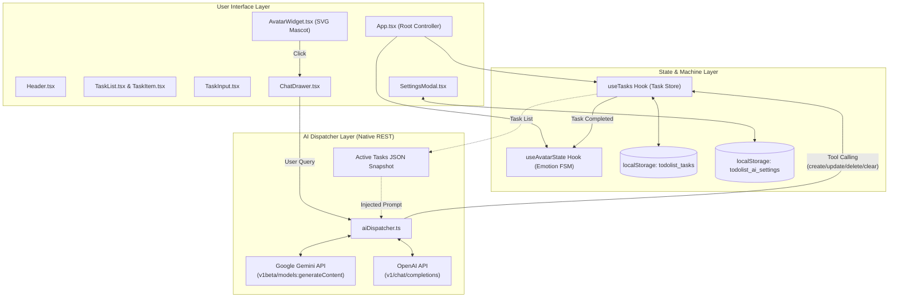
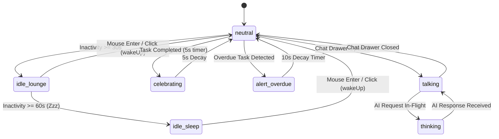

<div align="center">

# 🤖 Todolist AI

**A local-first, high-performance task dashboard with a living AI mascot companion & autonomous tool-calling dispatcher.**

[](#)
[](#)
[](#)
[](#)
[](#)
[](#)
[](#)

<br />

[Features](#-key-features) • [Architecture](#-system-architecture) • [AI Dispatcher](#-ai-tool-calling-engine) • [Quickstart](#-quickstart) • [Configuration](#-ai-setup--configuration) • [Quality Assurance](#-testing--verification)

</div>

---

## 💡 Overview

**Todolist AI** pairs a focused productivity workspace with an interactive, emotionally responsive **AI Mascot Companion**. 

Unlike standard todo list apps that rely on clunky form entries or third-party wrappers, **Todolist AI** operates **entirely client-side** using native browser APIs. Manage tasks manually through a clean interface or converse with your floating mascot companion using natural language. The companion automatically mutates your board through deterministic function calling while reacting with dynamic facial animations and living idle behaviors.

---

## ✨ Key Features

### 📋 1. Core Task Engine
- **Full Task Lifecycle**: Create, toggle, inline-edit on double-click, and delete tasks with sub-millisecond local latency.
- **Tri-Tier Priorities**: Instant visual triage with **Low** (`teal`), **Medium** (`amber`), and **High** (`rose`) priority pills.
- **Local Date & Overdue Engine**: Due dates format intuitively (`Today`, `Sep 20, 2026`). Overdue tasks are detected against local time and highlighted with pulsing danger badges.
- **Segmented Filter Tabs**: Filter across **All**, **Active**, and **Completed** with live counter pills and a 1-click **Clear completed** action.
- **Offline & Local-First**: Synchronizes immediately to browser `localStorage` (`todolist_tasks`). Zero database overhead.

### 🤖 2. Living SVG Mascot Companion
- **Adaptive Emotional States**: Powered by an internal state machine reacting to real-time user events:
  - 😴 **Living Inactivity**: Lounges after **30 seconds** of inactivity (`idle_lounge`); falls into deep sleep with floating animated `Zzz` after **60 seconds** (`idle_sleep`).
  - 🎉 **Celebration Wins**: Completing any task triggers a **5-second** celebration reaction with bouncing animations and sparkles (`celebrating`).
  - 🚨 **Overdue Alarm**: Detects overdue tasks upon load or edit and enters an alert state with a **10-second decay timer** (`alert_overdue`).
  - 💬 **Conversational Reactivity**: Displays `thinking` (pinging antenna) while waiting for AI generation and `talking` when the chat drawer is open.
- **Interactive Wake-Up**: Hovering or clicking the mascot instantly resets inactivity and wakes it up to `neutral`.

### 🧠 3. Autonomous AI Assistant & Tool Dispatching
- **Native REST Architecture (Zero Heavy SDKs)**: Interacts directly with official Google Gemini and OpenAI REST endpoints using browser `fetch`. No bulky client packages (`@google/genai` or `openai`), keeping bundle footprint under **82 kB (gzipped)**.
- **System Prompt Task Snapshot**: Every LLM turn dynamically injects an up-to-date JSON snapshot of active tasks (`id`, `title`, `completed`, `priority`, `dueDate`) along with today's date, enabling the bot to resolve phrases like *"finish task 1"* or *"delete the milk task"* to exact `id`s with **0% hallucination**.
- **Deterministic Tool Calling**:
  - `create_task({ title, priority, dueDate })`
  - `update_task({ id, completed, title, priority, dueDate })`
  - `delete_task({ id })`
  - `clear_completed_tasks()`
- **Action Confirmation Badges**: Every board mutation executed by the bot is transparently rendered in chat with interactive confirmation badges.

---

## 🏗️ System Architecture



### Mascot Emotional State Machine



---

## ⚡ AI Tool-Calling Engine

The AI Dispatcher abstracts Google Gemini and OpenAI behind a deterministic tool-calling interface:

| Tool Name | Parameters | Description |
|---|---|---|
| `create_task` | `title` (string, req), `priority` (low/med/high), `dueDate` (YYYY-MM-DD) | Creates and appends a new task to the board. |
| `update_task` | `id` (string, req), `completed` (bool), `title`, `priority`, `dueDate` | Mutates existing task properties or toggles completion. |
| `delete_task` | `id` (string, req) | Permanently deletes the task matching `id`. |
| `clear_completed_tasks` | *none* | Removes all completed tasks in one batch. |

### Supported AI Providers & Models

| Provider | Supported Models | Test Ping Endpoint | Key Storage |
|---|---|---|---|
| **Google Gemini** | `gemini-3.6-flash` (Default), `gemini-2.5-flash`, `gemini-1.5-flash`, `gemini-1.5-pro` | `GET /v1beta/models/{model}` (0 token cost) | Client `localStorage` |
| **OpenAI** | `gpt-4o-mini` (Default), `gpt-4o`, `gpt-3.5-turbo` | `GET /v1/models/{model}` (0 token cost) | Client `localStorage` |

---

## 🎨 Design System & Anti-AI Slop Guidelines

Strictly designed in accordance with `design-system/todolist-ai/MASTER.md`:

- **Color Tokens**:
  - Primary Accent: Deep Teal (`#0D9488`)
  - Action / CTA: Warm Orange (`#EA580C`)
  - Warning / Alert: Crimson Rose (`#DC2626` / `#E11D48`)
  - Card & Background: Pure White (`#FFFFFF`) with subtle Zinc borders (`border-zinc-200/80`)
- **Strict SVG Iconography**: Zero emoji used as icons. Every visual symbol (robot, antenna, calendar, trash, check, gear, eye) is rendered with pure, high-precision SVG paths.
- **Typography**: Google Font **Plus Jakarta Sans** with tabular `font-mono` figures for dates and count badges.
- **Accessible & Responsive**: Full keyboard navigation (`Enter`, `Escape`), semantic HTML5, visible focus rings, and zero layout shifting.

---

## 🚀 Quickstart

### Prerequisites

- **Node.js**: `v18.0.0` or higher
- **npm**: `v9.0.0` or higher

### 1. Clone & Install

```bash
git clone https://github.com/your-username/todolist-ai.git
cd todolist-ai
npm install
```

### 2. Run Development Server

```bash
npm run dev
```
Navigate to `http://localhost:5173` in your browser.

### 3. Run Automated Tests

Execute the Vitest test suite with 42 unit and integration tests:

```bash
npm test
```

For live watch mode during development:
```bash
npm run test:watch
```

### 4. Build for Production

Compile TypeScript and build the optimized production assets:

```bash
npm run build
```

Preview the production build locally:
```bash
npm run preview
```

---

## ⚙️ AI Setup & Configuration

1. Click the **Gear icon** in the top navigation header to open **AI Settings**.
2. Choose your provider:
   - **Google Gemini**: Get a free API key at [Google AI Studio](https://aistudio.google.com/app/apikey).
   - **OpenAI**: Get an API key at [OpenAI Platform](https://platform.openai.com/api-keys).
3. Select your model (defaults to `gemini-3.6-flash` or `gpt-4o-mini`).
4. Click **"Test Connection"** to verify credentials instantly without burning generation tokens.
5. Click **"Save Settings"**.
6. Click the floating Mascot in the bottom-right corner to open the **AI Assistant Drawer**!

---

## 🛡️ Security & Privacy Policy

- **No Remote Database**: Tasks and credentials live exclusively in your browser's `window.localStorage`.
- **Direct REST Calls**: API requests are transmitted directly from your client browser to the official Google/OpenAI API endpoints. No intermediary servers, proxies, or analytics trackers are used.
- **Safe Key Storage**: API keys are masked by default in the UI with a toggleable eye button and never serialized outside the `todolist_ai_settings` key.

---

## 🧪 Testing & Verification

The project enforces test-driven development (TDD) across 8 test suites:

```bash
 ✓ src/utils/date.test.ts (2 tests)
 ✓ src/utils/aiSettings.test.ts (6 tests)
 ✓ src/utils/aiDispatcher.test.ts (7 tests)
 ✓ src/hooks/useAvatarState.test.ts (4 tests)
 ✓ src/hooks/useTasks.test.ts (9 tests)
 ✓ src/components/AvatarWidget.test.tsx (3 tests)
 ✓ src/components/ChatDrawer.test.tsx (5 tests)
 ✓ src/components/SettingsModal.test.tsx (6 tests)

 Test Files  8 passed (8)
      Tests  42 passed (42)
```

---

## 📜 License

Distributed under the **MIT License**. See `LICENSE` for more information.
