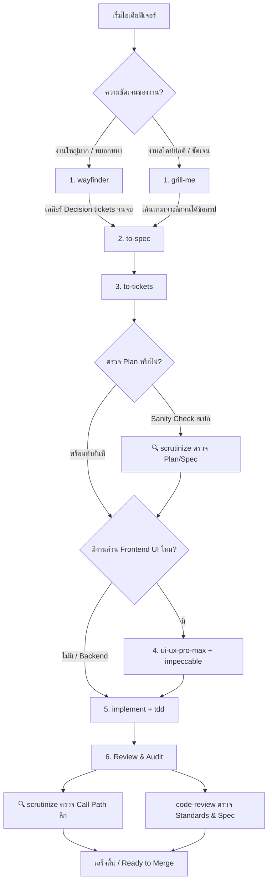
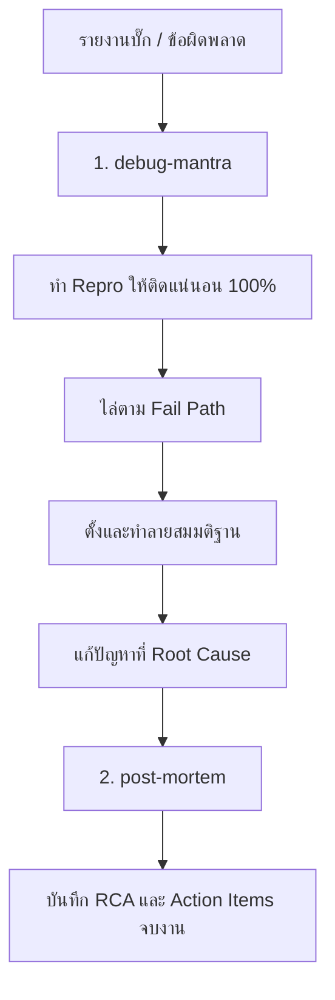

# คู่มือแนวทางการใช้งาน Agent Skills (Skills Workflow Guide)

คู่มือนี้สรุปหน้าที่และขั้นตอนการเชื่อมต่อ Skill ทั้ง 12 ตัวใน `.agents/skills` ตั้งแต่เริ่มงานจนจบงานจริง

---

## 1. หมวดหมู่ของ Skills ทั้งหมด (Overview)

| หมวดหมู่ | Skills | วัตถุประสงค์หลัก |
|---|---|---|
| **Planning & Scoping** | [`wayfinder`](.agents/skills/wayfinder/SKILL.md), [`grill-me`](.agents/skills/grill-me/SKILL.md), [`to-spec`](.agents/skills/to-spec/SKILL.md), [`to-tickets`](.agents/skills/to-tickets/SKILL.md) | วางแผน สโคปงาน เจาะลึกความต้องการ และแตกตั๋วงาน |
| **UI & Design Systems** | [`ui-ux-pro-max`](.agents/skills/ui-ux-pro-max/SKILL.md), [`impeccable`](.agents/skills/impeccable/SKILL.md) | ออกแบบระบบดีไซน์ โทนสี ฟอนต์ และขัดเกลารสนิยม UI |
| **Execution & Testing** | [`implement`](.agents/skills/implement/SKILL.md), [`tdd`](.agents/skills/tdd/SKILL.md) | ลงมือโค้ดแบบ Test-Driven Development (Red-Green Loop) |
| **Review & Quality Gate** | [`code-review`](.agents/skills/code-review/SKILL.md), [`scrutinize`](.agents/skills/scrutinize/SKILL.md) | ตรวจสอบคุณภาพโค้ดตามมาตรฐานและท้าทายสถาปัตยกรรม |
| **Bugfix & Diagnosis** | [`debug-mantra`](.agents/skills/debug-mantra/SKILL.md), [`post-mortem`](.agents/skills/post-mortem/SKILL.md) | สืบสวนแก้บั๊กอย่างเป็นระบบ และบันทึกประวัติ Root Cause |

---

## 2. เส้นทางการทำงานจริง 3 รูปแบบ (End-to-End Workflows)

### เส้นทางที่ 1: พัฒนาฟีเจอร์ใหม่ (Feature Development Lifecycle)

ใช้เมื่อต้องการสร้าง Feature, Service หรือหน้าใหม่ ตั้งแต่ไอเดียจนเสร็จสมบูรณ์

#### รายละเอียดแต่ละขั้นตอน:
1. **Scope & Clarify (เลือก 1 ตัว):**
   - **กรณีงานใหญ่/คลุมเครือ:** เรียก [`wayfinder`](.agents/skills/wayfinder/SKILL.md) เพื่อกางแผนที่แตกเป็น *Decision Tickets* ทยอยเคลียร์ข้อสงสัยทีละเปลาะ
   - **กรณีฟีเจอร์สโคปปกติ:** เรียก [`grill-me`](.agents/skills/grill-me/SKILL.md) เพื่อสัมภาษณ์เจาะลึก ต้อนความต้องการให้กระชับและไม่หลุดขอบเขต
2. **สรุปความต้องการเป็นทางการ:**
   - เรียก [`to-spec`](.agents/skills/to-spec/SKILL.md) เพื่อสังเคราะห์การพูดคุยออกมาเป็นโครงสร้าง Spec (Problem, Solution, User Stories, Implementation Decisions)
3. **แตกชิ้นงานเป็นตั๋ว:**
   - เรียก [`to-tickets`](.agents/skills/to-tickets/SKILL.md) เพื่อหั่น Spec ออกเป็นงานชิ้นเล็กแบบ Vertical Slice (Tracer Bullet) พร้อมกำหนดความสัมพันธ์ Blocked by
   - **[จุดแทรกที่ 1 ของ `scrutinize` - Plan Audit]:** เรียก [`scrutinize`](.agents/skills/scrutinize/SKILL.md) เพื่อทำ Sanity Check ตัว Spec/Plan จากมุมมองคนนอก: *"มีวิธีที่ง่ายกว่านี้ไหม? Over-engineered ไปหรือเปล่า? จุดไหนที่ตั้งสมมติฐานผิดกับระบบเดิม?"*
4. **วางโครงสร้างและดีไซน์ UI (ถ้ามี Frontend):**
   - ใช้ [`ui-ux-pro-max`](.agents/skills/ui-ux-pro-max/SKILL.md) เลือกโครงสร้างดีไซน์, คู่สี, ฟอนต์ และโทเคนตาม Stack
   - ใช้ [`impeccable`](.agents/skills/impeccable/SKILL.md) (เช่น `/impeccable polish` หรือ `/impeccable craft`) เพื่อกำจัดความโหลของ AI และปรับจูนรสนิยม
5. **ลงมือสร้าง:**
   - หยิบตั๋วที่ปลดบล็อกแล้วมารัน [`implement`](.agents/skills/implement/SKILL.md)
   - ขับเคลื่อนการโค้ดด้วย [`tdd`](.agents/skills/tdd/SKILL.md) เทสต์เฉพาะรอยต่อสาธารณะ (Public Seams) แบบ Red-Green Loop
6. **ตรวจรับงานก่อนส่ง (Review & Quality Gates):**
   - **[จุดแทรกที่ 2 ของ `scrutinize` - Deep Trace]:** เรียก [`scrutinize`](.agents/skills/scrutinize/SKILL.md) ไล่ตรวจ Call Path จริงทั้งระบบ (ไม่ได้ดูแค่ Diff) เพื่อยืนยันว่าไม่มี Edge case หลุดรอด และพฤติกรรมตรงตามที่เคลมจริง
   - รัน [`code-review`](.agents/skills/code-review/SKILL.md) ตรวจสอบคู่ขนาน 2 แกน: **Standards** (ตรวจจับ Code Smells) และ **Spec** (ตรงตามโจทย์ที่ตกลงไว้ไหม)
   - ถ้าเป็นเว็บ รันคำสั่ง `npx impeccable detect` ตรวจสอบความเรียบร้อยรอบสุดท้าย

---

### เส้นทางที่ 2: แก้ไขปัญหาและบั๊ก (Bugfix & Incident Lifecycle)

ใช้เมื่อเกิดข้อผิดพลาด บั๊ก หรือระบบพัง **(ข้ามขั้นตอนวางแผนทั้งหมด)**

#### รายละเอียดแต่ละขั้นตอน:
1. **สืบสวนด้วยวินัย 4 ข้อ:**
   - เรียก [`debug-mantra`](.agents/skills/debug-mantra/SKILL.md) ปฏิบัติตามกฎเหล็ก:
     1. *First is reproducibility:* สร้าง Test / Script จำลองบั๊กให้เกิดซ้ำได้เสถียร
     2. *Know the fail path:* แกะเส้นทางล้มเหลว (Debugger → Source Trace → Probe Logs)
     3. *Question your hypothesis:* พยายามหักล้างสมมติฐานก่อนลงมือแก้จริง
     4. *Every run is a breadcrumb:* จดบันทึกผลการทดลองทุกครั้ง
2. **ลงมือแก้ไข:**
   - แก้ไขที่จุดกำเนิดปัญหา ไม่ใช่การดักแก้แค่ตามอาการ
3. **บันทึกองค์ความรู้:**
   - เรียก [`post-mortem`](.agents/skills/post-mortem/SKILL.md) เพื่อบันทึกเอกสารสรุป (Summary, Symptom, Root Cause, Fix, Validation, Action Items) โดยยึดหลัก Blameless ไม่โทษบุคคล

---

### เส้นทางที่ 3: ตรวจสอบโค้ด / รับความเห็นที่สอง (Review & Audit Lifecycle)

ใช้เมื่อมีโค้ดอยู่แล้ว, มีคนส่ง PR มาให้ตรวจ, หรือต้องการทบทวน Plan ก่อนลงมือทำจริง

1. **มุมมองบุคคลที่สาม (Outsider Audit):**
   - รัน [`scrutinize`](.agents/skills/scrutinize/SKILL.md) เพื่อตั้งคำถามว่า:
     - การเปลี่ยนแปลงนี้จำเป็นต้องมีจริงหรือไม่? มีทางแก้ที่ง่ายกว่านี้ไหม?
     - ไล่ Call Path จริงตั้งแต่ต้นจนจบเพื่อดูผลกระทบข้างเคียง
2. **ตรวจมาตรฐานการเขียนโค้ด:**
   - รัน [`code-review`](.agents/skills/code-review/SKILL.md) เทียบโค้ดกับข้อกำหนดของ Repo และ Fowler Refactoring Smells

---

## 3. สรุปเช็กลิสต์การเลือกใช้ (Quick Decision Cheat Sheet)

| สถานการณ์ | Skill เริ่มต้นที่ต้องใช้ |
|---|---|
| มีไอเดียกว้างๆ ใหญ่มาก ยังมองไม่เห็นทางข้างหน้า | [`wayfinder`](.agents/skills/wayfinder/SKILL.md) |
| รู้ว่าจะทำอะไร แต่อยากเค้นขอบเขตและรายละเอียดให้คม | [`grill-me`](.agents/skills/grill-me/SKILL.md) |
| คุยจบแล้ว ต้องการสรุปเป็นเอกสาร Spec ทางการ | [`to-spec`](.agents/skills/to-spec/SKILL.md) |
| มี Spec แล้ว ต้องการหั่นเป็นงานชิ้นเล็กส่งทีมทำ | [`to-tickets`](.agents/skills/to-tickets/SKILL.md) |
| ต้องการวางระบบดีไซน์ สี ฟอนต์ หรือ UX ตาม Stack | [`ui-ux-pro-max`](.agents/skills/ui-ux-pro-max/SKILL.md) |
| ต้องการปรับมู้ดแอนด์โทน UI ไม่ให้ดูเหมือนเทมเพลต AI โหลๆ | [`impeccable`](.agents/skills/impeccable/SKILL.md) |
| มี Ticket งานชัดเจนแล้ว พร้อมเริ่มเขียนโค้ด | [`implement`](.agents/skills/implement/SKILL.md) + [`tdd`](.agents/skills/tdd/SKILL.md) |
| เขียนโค้ดเสร็จแล้ว ต้องการตรวจก่อน Merge | [`code-review`](.agents/skills/code-review/SKILL.md) |
| อยากได้ Second Opinion ท้าทาย Plan หรือ PR แบบเข้มข้น | [`scrutinize`](.agents/skills/scrutinize/SKILL.md) |
| เกิดบั๊ก ระบบพัง ต้องการสืบหาต้นเหตุอย่างมีวินัย | [`debug-mantra`](.agents/skills/debug-mantra/SKILL.md) |
| แก้บั๊กเสร็จแล้ว ต้องการเขียนบันทึกประวัติทางวิศวกรรม | [`post-mortem`](.agents/skills/post-mortem/SKILL.md) |
